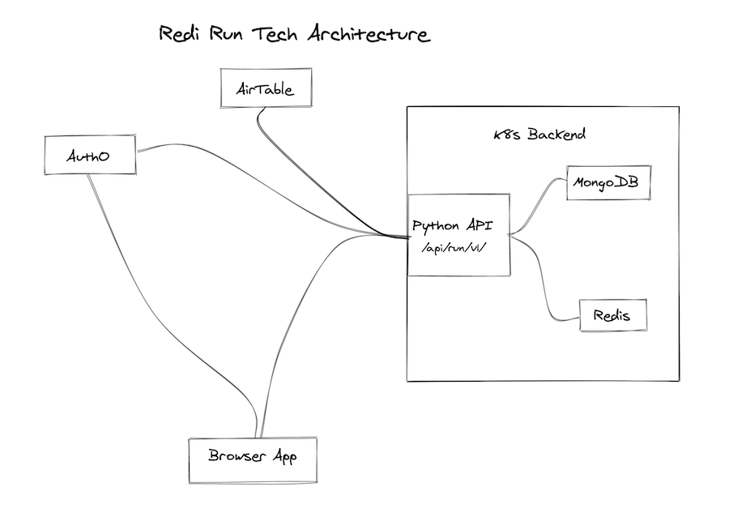

# REDI Run Backend

A API written with python + flask. Directly supports [REDI Run frontend react app](https://github.com/redi-js-teachers/js_sprint_2020_final_project_khomtali)

## Docs

This api is fully documented via [docs/openapi.yaml](docs/openapi.yaml), the
swagger ui can be found
**[here](https://btbtravis.github.io/redi-run-api/)**

## Arch



## Development

*Currently @btbtravis is the sole contributer. This information needs to be updated before inviting collaborators*

Dev setup requries locally running:

- MongoDB server, in the future a docker-compose.yml will be provided for this
- Redis server, in the future a docker-compose.yml will be provided for this
- Python 3.7+ and pipenv as dependencies in the project are managed via pipenv

So the basic setup would look like this:

```shell
$ git clone git@gitlab.com:BTBTravis/redi-run-backend.git
$ cd redi-run-backend
$ cp .env.sample .env
```
*then update .env values*
```shell
$ pipenv install
$ pipenv shell
$ FLASK_APP=redi-run-app.py flask run -p 5001 --reload
```

# Helpful links for development

- https://redis.io/commands
- https://realpython.com/python-redis/
- https://redis-py.readthedocs.io/en/stable/
- https://2.python-requests.org/en/master/api
- https://cloud.canister.io/n/travisshears/redi-run
- https://excalidraw.com/
- http://docs.mongoengine.org/apireference.html
- https://auth0.com/docs/api/management/v2#!/Users